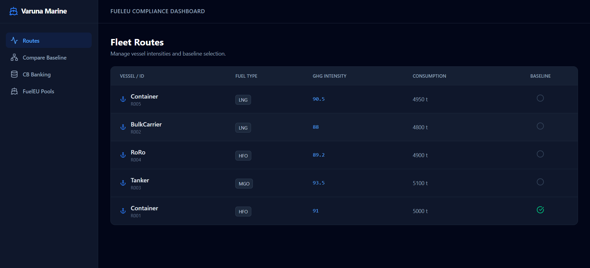

# 🌊 Varuna Marine - FuelEU Compliance Dashboard

A professional-grade, full-stack dashboard built to monitor vessel GHG intensity, manage FuelEU compliance, and simulate carbon credit pooling. 

## 📸 Dashboard Previews

### 1. Fleet Routes & Baseline Selection


### 2. Baseline Comparison Analytics


---

## 🏗️ Architecture Summary (Hexagonal Structure)
The project follows **Hexagonal Architecture (Ports & Adapters)** to strictly decouple business logic from infrastructure:
- **Core (Domain/Application)**: Pure TypeScript logic for FuelEU math, compliance balancing, and greedy pooling algorithms.
- **Adapters (Inbound)**: Express.js controllers handling HTTP REST requests.
- **Adapters (Outbound)**: Prisma ORM for PostgreSQL database persistence.

## 💻 Tech Stack
- **Frontend**: React 19, Vite, Tailwind CSS 4.0, Recharts
- **Backend**: Node.js 22, Express.js, Prisma v6
- **Database**: PostgreSQL
- **Language**: TypeScript across the entire stack

---

## 🚀 Getting Started

### Prerequisites
- Node.js (v18+)
- PostgreSQL running on port `5433` with a database named `varuna_db`.

### 1. Backend Setup (Terminal 1)
Navigate to the backend directory and set up the database:
```bash
cd backend
npm install
npx prisma db push

# Seed the database using the pure JS script to bypass edge runtime conflicts
node seed.js

# Start the server (runs on port 3000)
npm run dev